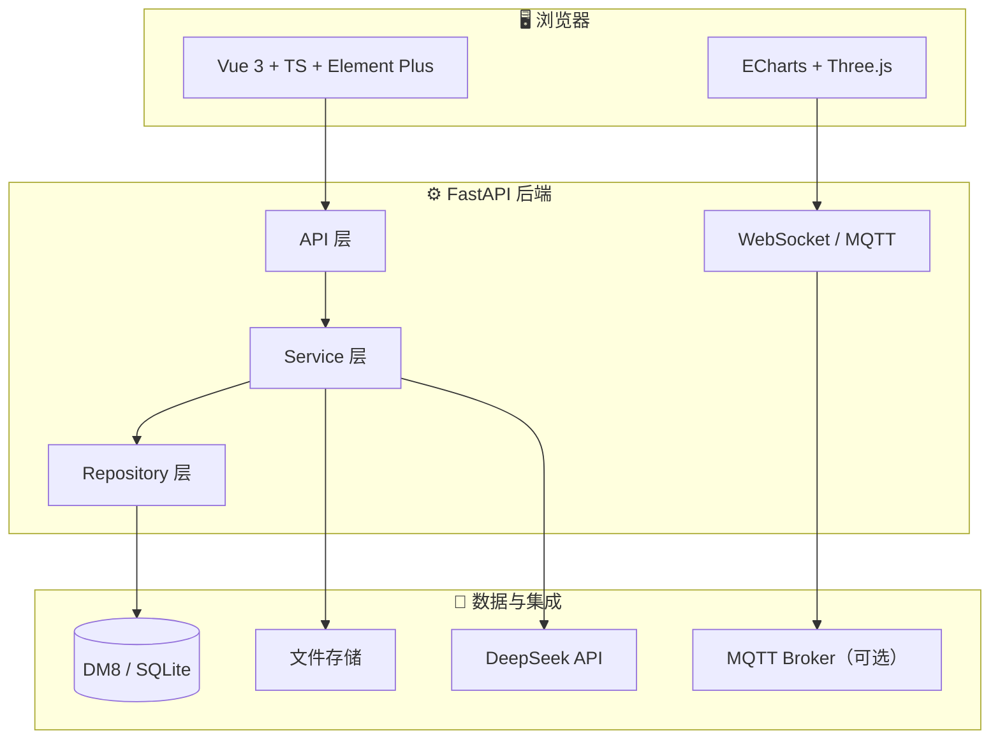

# 🌊 校园湖海试验场数字孪生全景监控与数据管理系统

<p align="center">
  <strong>《应用软件架构课程设计》综合实践项目</strong><br/>
  面向高校船舶与海洋工程湖海试验场 · 预约审批 · 数字孪生 · 实时监控 · AI 分析
</p>

<p align="center">
  
  
  
  
  
  
  
</p>

<p align="center">
  <a href="#-课程设计说明">课程说明</a> ·
  <a href="#-快速启动">快速启动</a> ·
  <a href="#-答辩演示链路">答辩演示</a> ·
  <a href="#-文档导航">文档</a> ·
  <a href="#-技术栈">技术栈</a>
</p>

---

## 📚 课程设计说明

> **本项目是《应用软件架构课程设计》的完整实现案例**，目标不是交付工业级生产系统，而是在有限周期内完成一个**架构清晰、亮点突出、可完整演示业务闭环**的数字孪生试验场管理平台。

### 🎯 课程目标对照

| 课程要求 | 本项目实现 | 对应模块 / 文档 |
| --- | --- | --- |
| 前后端分离 | Vue 3 SPA + FastAPI REST/WS | [architecture.md](./docs/architecture.md) |
| 后端分层架构 | `API → Service → Repository → Model` | [backend/README.md](./backend/README.md) |
| 主从表业务 ⭐ | `EXP_RESERVATION` + `EXP_RESERVATION_RESOURCE` | 试验预约页、两级审批 |
| 4–6 个可演示模块 | 登录权限、预约审批、资源管理、监控告警、归档回放、AI 分析 | 见 [功能模块](#-功能模块一览) |
| 国产数据库 DM8 | 表结构、部署文档、健康检查 | [dm8-deployment.md](./docs/dm8-deployment.md) |
| WebSocket 实时接口 | 监控帧推送、CV 轨迹、设备状态 | [smart-console.md](./docs/smart-console.md) |
| DeepSeek API | 试验 AI 报告（Mock / 真实 API 可切换） | [ai-report.md](./docs/ai-report.md) |
| 数字孪生展示 | Three.js 水池场景 + 智能中控台 | 数字孪生监控页 |

### 🏆 设计亮点（答辩可讲）

- **主从表 + 两级审批**：预约头表 + 资源明细从表，教师审核 → 主任审批 → 自动生成试验任务
- **资源冲突校验**：提交预校验 + 审批前终校验，体现业务规则而非简单 CRUD
- **智能中控台**：视频感知、CV 识别联动、设备指令、系统健康条 —— 监控页「像控制台」
- **试验全生命周期**：`预约 → 审批 → 准备 → 运行 → 监控告警 → 归档回放 → AI 报告`
- **可切换数据源**：默认 WebSocket 模拟；可选 MQTT 接入（加分演示）
- **审计与演示友好**：操作日志、一键重置演示数据、完整答辩脚本

### ⚠️ 课程设计边界（刻意不做）

- ❌ 不追求真实硬件全量接入（允许模拟数据 / Mock）
- ❌ 不把系统改造成通用 IoT 平台
- ❌ 不在前端暴露 DeepSeek API Key
- ❌ 不绕过 Service 层写「胖 Controller」

---

## ✨ 项目简介

系统围绕**湖海试验场**的日常业务，覆盖从「学生预约试验」到「AI 生成分析报告」的完整链路：

```text
📝 预约草稿 → 📤 提交预约 → 👨‍🏫 教师审核 → 👔 主任审批 → 📋 生成试验任务
    → 🔧 任务准备 → ▶️ 现场试验 → 📡 实时监控与告警 → 📦 数据归档 → 🤖 AI 分析报告
```

**一句话概括**：这是一个能跑通业务流程、能大屏演示数字孪生、能体现架构与国产技术栈的课程设计作品。

---

## 🧭 功能模块一览

| 模块 | 说明 | 页面 / 接口 |
| --- | --- | --- |
| 🔐 登录与权限 | JWT 鉴权、角色菜单、接口权限 | `/login`、各业务 API |
| 📅 试验预约 | 草稿、主从表明细、提交与撤回 | `/reservations` |
| ✅ 两级审批 | 教师审核、主任审批、审批日志 | 预约详情、任务生成 |
| 🛠️ 资源设备 | 水池/模型船/传感器 CRUD、状态维护 | `/resources` |
| 📋 试验任务 | 状态机流转、跳转监控 | `/experiments` |
| 🖥️ 数字孪生监控 | 3D 场景、实时曲线、智能中控台 | `/monitor` |
| 🚨 告警管理 | 越界、低电量、突变等 | `/alarms` |
| 📦 试验归档 | 轨迹回放、文件、时间轴 | `/archive` |
| 🤖 AI 分析 | DeepSeek 五段式报告 | `/ai-report` |
| 📊 工作台 | 统计卡片 + ECharts 驾驶舱 | `/dashboard` |
| 📝 操作审计 | 管理员查看关键操作日志 | `/audit-logs` |

---

## 🏗️ 总体架构



**核心业务规则（v1 固定）**

| 规则 | 说明 |
| --- | --- |
| 审批流 | 教师审核 → 主任审批（两级） |
| 资源冲突 | 提交预校验 + 主任审批前终校验 |
| 任务状态机 | `PENDING_PREPARE → READY → RUNNING → COMPLETED → ARCHIVED` |
| 数据删除 | 重要业务表逻辑删除 + 审计字段 |

---

## 🖥️ 智能中控台（数字孪生监控）

监控页采用**两栏智能中控台**布局，与全局 UI（浅蓝侧栏 + 白卡片）统一：

```
┌─────────────────────────────────────┬──────────────────┐
│  📹 视频感知（模拟/MJPEG/MP4）       │  📊 运行指标 KPI  │
│  ↕ CV 识别 ↔ 孪生联动              │  🚨 实时告警      │
│  🌊 数字孪生水池（Three.js）         │  ⚙️ 设备控制台    │
│  📈 实时曲线（ECharts）              │                  │
└─────────────────────────────────────┴──────────────────┘
```

详见 👉 [docs/smart-console.md](./docs/smart-console.md)

---

## 🛠️ 技术栈

<details>
<summary><strong>Frontend</strong></summary>

| 技术 | 用途 |
| --- | --- |
| Vue 3 + TypeScript | 组件化 SPA |
| Vite | 构建与热更新 |
| Element Plus | UI 组件库 |
| ECharts | 统计图表、实时曲线 |
| Three.js | 数字孪生 3D 水池场景 |
| Pinia | 状态管理（用户/权限） |

</details>

<details>
<summary><strong>Backend</strong></summary>

| 技术 | 用途 |
| --- | --- |
| Python 3.11 | 运行时 |
| FastAPI | REST API + WebSocket |
| SQLAlchemy | ORM |
| Pydantic | 请求/响应校验 |
| Uvicorn | ASGI 服务器 |
| pytest | 单元测试 |

</details>

<details>
<summary><strong>Database & Integration</strong></summary>

| 技术 | 用途 |
| --- | --- |
| SQLite | 本地开发（零配置） |
| 达梦 DM8 | 答辩 / 生产（国产数据库要求） |
| DeepSeek API | AI 试验分析报告 |
| MQTT | 可选实时数据接入 |
| 本地文件系统 | 归档附件、演示视频 |

</details>

---

## 📁 项目结构

```text
lakesea-digital-twin/
├── 📄 README.md                 # 本文件
├── 📄 AGENTS.md                 # AI 协作约束
├── 🚀 lakesea.bat               # Windows 一键脚本（setup / run / defense …）
├── 📂 docs/                     # 设计文档、答辩脚本、部署指南
│   ├── architecture.md          # 总体架构
│   ├── requirements.md          # 需求与范围
│   ├── database-design.md       # 数据库设计
│   ├── api-design.md            # 接口设计
│   ├── demo-script.md           # ⭐ 答辩演示顺序
│   ├── dm8-deployment.md        # 达梦部署
│   └── smart-console.md         # 智能中控台说明
├── 📂 frontend/                 # Vue 3 前端
│   └── src/
│       ├── views/               # 页面（MonitorView、DashboardView …）
│       ├── components/          # 组件（TwinScene、monitor/* …）
│       └── api/                 # API 封装
└── 📂 backend/                  # FastAPI 后端
    └── app/
        ├── api/                 # 路由层
        ├── services/            # 业务层
        ├── repositories/        # 数据访问层
        ├── models/              # ORM 模型
        └── scripts/             # 种子数据、演示重置、冒烟测试
```

---

## 🚀 快速启动

### 方式一：Windows 一键脚本（推荐 ⭐）

项目根目录 **`lakesea.bat`** 汇总常用操作：

```bat
lakesea.bat setup          REM 首次安装（SQLite + 依赖）
lakesea.bat run            REM 启动前后端
lakesea.bat defense        REM 答辩前：重置演示数据 + 启服
lakesea.bat defense-dm8    REM 达梦答辩模式
lakesea.bat reset          REM 仅重置演示数据
lakesea.bat test           REM 运行后端测试
lakesea.bat smoke          REM 端到端冒烟
```

> 旧脚本 `setup.bat`、`run-all.bat`、`pre-defense.bat` 等已转发到 `lakesea.bat`。

### 方式二：手动启动

**后端**

```bat
cd backend
python -m venv .venv
.venv\Scripts\activate
pip-install.bat
copy .env.example .env
python -m scripts.seed_db
uvicorn app.main:app --reload
```

- API 文档：http://127.0.0.1:8000/docs
- `pip-install.bat` 优先走代理 `127.0.0.1:7897`，失败自动切换清华镜像

**前端**

```bash
cd frontend
npm install
npm run dev
```

- 开发地址：http://localhost:5173
- 代理：`/api` → `8000`，`/ws` → WebSocket

### 达梦 DM8（答辩 / 加分）

```bash
cd backend
copy .env.dm8.example .env    # 修改 DATABASE_URL
# 在达梦管理工具执行 scripts/init_db.sql
python -m scripts.seed_db
uvicorn app.main:app --reload
```

完整步骤 👉 [docs/dm8-deployment.md](./docs/dm8-deployment.md)

### 测试与验收

```bash
cd backend && pytest                    # 后端单元测试
cd frontend && npm run build              # 前端生产构建
cd backend && python -m scripts.smoke_test  # 冒烟（需先启后端）
```

---

## 🎬 答辩演示链路

> 完整脚本（约 15–20 分钟）见 **[docs/demo-script.md](./docs/demo-script.md)**

| 步骤 | 角色 | 操作 | 展示要点 |
| --- | --- | --- | --- |
| 1 | `admin` | 登录 → 工作台 | 驾驶舱统计、ECharts、数据库类型 |
| 2 | `student01` | 新建预约 + 多条资源明细 | ⭐ **主从表** |
| 3 | `student01` | 提交预约 | 资源冲突检测 |
| 4 | `teacher01` | 教师审核通过 | 审批流第一步 |
| 5 | `director01` | 主任审批通过 | 审批日志 → 生成任务 |
| 6 | 任意 | 任务准备 → 启动 | 状态机流转 |
| 7 | 任意 | 数字孪生监控 | 3D 场景、曲线、告警、中控台 |
| 8 | 任意 | 完成试验 → 归档 | 轨迹回放、文件 |
| 9 | 任意 | AI 分析 | DeepSeek 报告（Mock 可演示） |

**答辩前一键准备**：`lakesea.bat defense` 或 `pre-defense.bat`（重置数据 + 启服 + 开浏览器）

### 👤 演示账号

密码均为 **`123456`**

| 用户名 | 角色 | 典型用途 |
| --- | --- | --- |
| `student01` | 学生 | 创建预约、提交 |
| `teacher01` | 教师 | 教师审核 |
| `director01` | 主任 | 主任审批 |
| `admin` | 管理员 | 用户管理、操作日志 |
| `maintainer01` | 维护人员 | 资源维护 |

---

## 📌 当前状态


**已完成 ✅**

- 设计文档与 API / 数据库基线
- 前后端完整实现与分层架构
- 预约主从表 + 两级审批 + 资源冲突校验
- WebSocket 模拟数据 + 数字孪生智能中控台
- 告警、归档回放、文件管理
- AI 报告（Mock / DeepSeek 可切换）
- MQTT 可选接入、操作审计日志
- 演示数据一键重置、答辩脚本与截图清单

**可选后续 🔧**

- 达梦生产环境联调
- 配置真实 DeepSeek API Key（`.env` 中 `MOCK_AI=false`）
- 更多真实设备 / 视频源接入

---

## 📖 开发约束

为保证课程设计目标与协作一致性：

1. **不要**绕过 Service 层 — 复杂业务不得直接写在 API 路由
2. **不要**删除预约主从表设计 — 这是课程硬性亮点
3. **不要**在前端暴露 DeepSeek API Key
4. **不要**把系统改造成普通设备管理平台
5. **不要**过度追求真实硬件 — 课程阶段允许模拟数据

AI 协作请同时阅读 👉 [AGENTS.md](./AGENTS.md)

---

## 🗂️ 文档导航

| 文档 | 说明 |
| --- | --- |
| [requirements.md](./docs/requirements.md) | 需求与范围（课程 v1） |
| [architecture.md](./docs/architecture.md) | 总体架构设计 |
| [database-design.md](./docs/database-design.md) | 数据库详细设计 |
| [api-design.md](./docs/api-design.md) | 接口详细设计 |
| [demo-script.md](./docs/demo-script.md) | ⭐ 答辩演示脚本 |
| [demo-data.md](./docs/demo-data.md) | 演示数据说明 |
| [dm8-deployment.md](./docs/dm8-deployment.md) | 达梦 DM8 部署 |
| [smart-console.md](./docs/smart-console.md) | 智能中控台 |
| [ai-report.md](./docs/ai-report.md) | AI 分析报告 |
| [mqtt-integration.md](./docs/mqtt-integration.md) | MQTT 接入 |
| [audit-log.md](./docs/audit-log.md) | 操作审计日志 |
| [archive-replay.md](./docs/archive-replay.md) | 归档回放 |
| [todo-checklist.md](./docs/todo-checklist.md) | 改造进度对照 |
| [screenshot-checklist.md](./docs/screenshot-checklist.md) | 答辩截图清单 |

子项目说明：[backend/README.md](./backend/README.md) · [frontend/README.md](./frontend/README.md)

---

## 🗺️ Roadmap

### 设计阶段 ✅

- [x] 统一需求范围与总体设计
- [x] 明确审批流、资源占用规则、任务状态机
- [x] 补齐数据库与接口详细设计

### 实现阶段 ✅

- [x] 前后端工程骨架与分层架构
- [x] 登录鉴权与角色菜单
- [x] 预约审批主从表业务
- [x] 资源管理与冲突校验
- [x] WebSocket 监控与数字孪生页
- [x] 告警、归档、AI 报告

### 增强阶段 ✅

- [x] 首页驾驶舱与用户管理
- [x] 达梦 DM8 部署文档与健康检查
- [x] 智能中控台（视频 + CV + 设备控制）
- [x] 试验归档回放与 MQTT 可选接入
- [x] 操作审计、演示重置、答辩脚本

---

## 🤝 适用场景

- 🎓 **课程答辩**：完整业务闭环 + 架构讲解 + 国产数据库 / AI 集成展示
- 📚 **架构学习**：前后端分离、分层设计、主从表、状态机、WebSocket 实践
- 🔬 **试验场 Demo**：预约审批、监控大屏、告警、归档一体化演示

---

## 📄 License

本项目用于**课程设计与学习交流**，默认按仓库所有者课程用途管理。如需开源许可，可后续补充 `LICENSE` 文件。

---

<p align="center">
  <sub>Made with 💙 for Application Software Architecture Course Design</sub><br/>
  <sub>校园湖海试验场 · 数字孪生 · 2025</sub>
</p>
